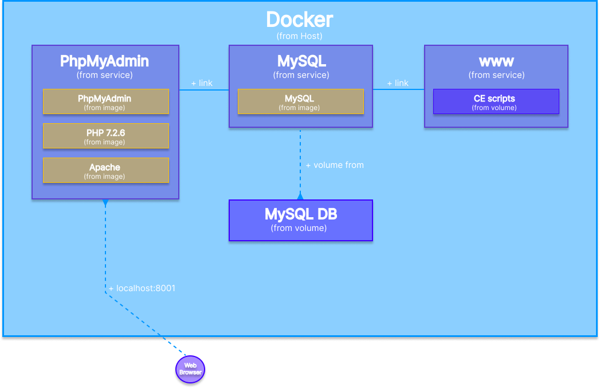

# Architecture Overview

## Docker

>How I used Docker in this project:

Each service represent a ***container in execution***. ***PhpMyAdmin***, ***www*** and ***MySQL*** are the services showed inside the ***Docker Host***. PhpMyAdmin is the only service that can be accessed from outside the Docker Host. All services, ***PhpMyAdmin***, ***www*** and ***MySQL*** are bounded by a ***link***. The images that were created to stablish the services PhpMyAdmin and MySQL are located inside of each ***container***.The service of ***MySQL*** use a ***volume*** to store all data bases, as the ***www*** use a volume to store CE content.

## SQL Database

> ***CE Database***: Entity relationship diagram

```mermaid
classDiagram
    user <--> Category
    Category <--> Product
    user : +int id
    user : +String email
    user : +String password
    user : +String user_firstname
    user : +String user_secondname
    user : +String business_name
    user : +String business_legal_regime
    user : +String Business_description
    user : +primary_key(id)
    class Category{
      +int id
      +String name
      +int id_user
      +primary_key(id)
      +foreign_key(id_user)
    }
    class Product{
      +int id
      +String product_name
      +int minimum_stock
      +int current_stock
      +String product_description
      +String product_location
      +String product_code
      +int category
      +primary_key(id)
      +foreign_key(category)
    }
```

In this schema, ***user*** table stores information about the app user and the business that he/she runs. Each user creates new categories, which are stored in ***category*** table, and each category has products, which are stored in ***product*** table.
